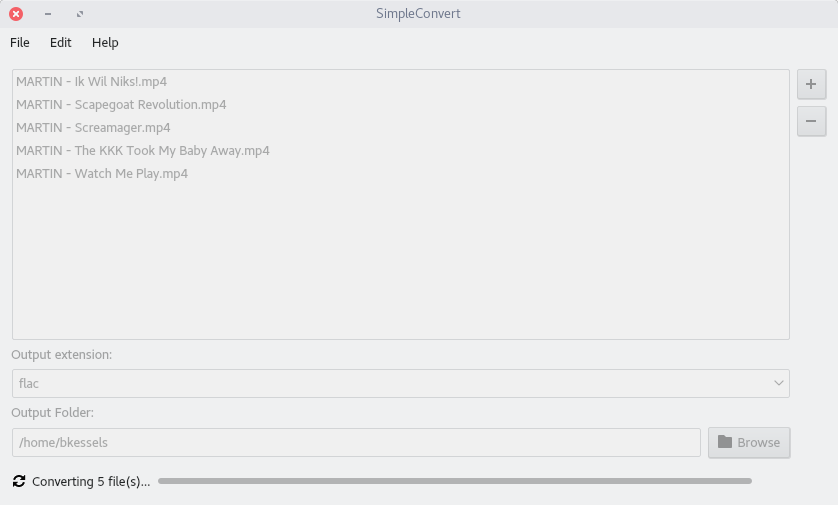

# SimpleConvert

Application to convert multiple files to another filetype using FFMPEG.

## Screenshots




## What can I do with it?

SimpleConvert is a small application to convert video and/or
audio files to any filetype using ffmpeg. This application aims
to provide an easy to understand interface so everyone will be
able to use the power of ffmpeg.

## Required packages

### Building

- qt5-devel

### Installing

- qt5
- ffmpeg

## How to build

### Linux

```
$ qmake
$ make install
```

And then run `simpleconvert`

### Windows

This method assumes you're using the Microsoft build tools.

```
> qmake
> nmake release
```

To be able to run SimpleConvert you need to copy all the
necessary Qt `.dll` files to the same location as `simpleconvert.exe`
so the binary can find the required libraries.

## Packaging

### RPM package

```
$ cd data/packaging/RPM
$ spectool -g simpleconvert.spec
$ fedpkg --release f28 local
```

This will create a RPM file which you can install using you package manager.

### Flatpak bundle

```
$ cd data/packaging/flatpak
$ flatpak-builder --repo=simpleconvert_repo simpleconvert net.bartkessels.simpleconvert.json
$ flatpak build-bundle simpleconvert_repo simpleconvert.flatpak net.bartkessels.SimpleConvert
```

This will create a flatpak bundle called `simpleconvert.flatpak`. To install the flatpak bundle
just run the flatpak install command.

```
$ flatpak install simpleconvert.flatpak
```

Once installed you can run it from flatpak

```
$ flatpak run net.bartkessels.SimpleConvert
```

## Pre-built binaries

### RPM from COPR

If you're running fedora you can easily install SimpleConvert from [COPR](https://copr.fedorainfracloud.org/coprs/bartkessels/simpleconvert/).

```
$ dnf copr enable bartkessels/simpleconvert
$ dnf install simpleconvert
```
