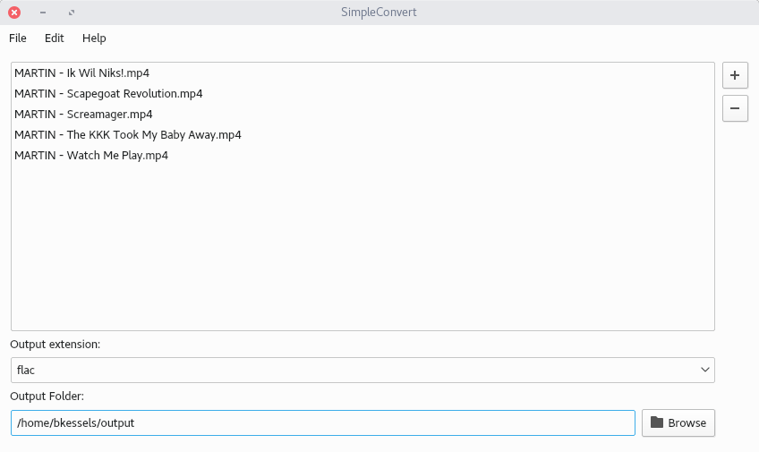

# Simple Convert

Application to convert multiple files to another filetype.

## Screenshots



## What can I do with it?

You can convert multiple files (at once!) to another filetype using FFMPEG.
This application provides an easy to understand UI and will convert all the files
to a specified directory.

## Required packages

### Regular packages

- gettext
- ffmpeg

Install these packages using your distributions package manager.

---

If you don't have ffmpeg installed the application won't be able to convert the files.
When you run it from the terminal you'll get this message:
<br>
```
FileNotFoundError: [Errno 2] No such file or directory: 'ffmpeg': 'ffmpeg'
```

### Python packages

- python-gettext
- setuptools
- pygobject >= 3.24
- ffmpeg-python >= 0.1.9

Install these packages using `easy_install` or `pip` but make sure you
install them for Python 3.

---

If you get the `ModuleNotFoundError` make sure you installed the required
packages for Python 3.

To install the required packages for Python 3 just run

```
$ python3 -m easy_install python-gettext
$ python3 -m easy_install setuptools
$ python3 -m easy_install 'pygobject>=3.24'
$ python3 -m easy_install 'ffmpeg-python>=0.1.9'
```

## How to build

```
$ python3 setup.py install
```

And then you can run `simpleconvert`.
